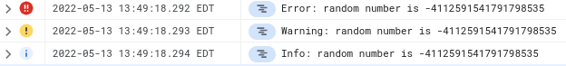

To run:
```
export PROJECT_ID=[your project id]
export export VERSION=[app version for deployment]
mvn clean package appengine:deploy -Dapp.deploy.projectId=$PROJECT_ID -Dapp.deploy.version=$VERSION
```

Then ping the AppEngine root endpoint. You'll see output like
```
I just logged a random number: -4112591541791798535
```

In Cloud Logging, you'll see the same number logged at multiple severity levels:


